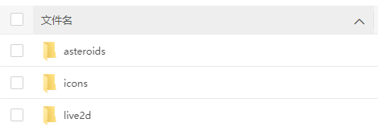

# live2d

#### 介绍
使用live2d安装到网站教程，超详细！超简单！（附带多种模型）


#### 安装教程

1.  先把必要的三个文件夹下载下来，然后上传到服务器网站目录（ps:这里的目录文件必须是可以通过链接访问的）


2.  在你的网站首页文件index.html中插入以下代码 (ps:记得看准文件路径)

 `在头部<head>标签内引入css样式`

```
<link rel="stylesheet" href="/live2d/css/live2d.css" />
<link rel="stylesheet" href="/live2d/css/waifu.css" />
```

 `在尾部<body>标签内引入js及初始化live2d`
```
<script type="text/javascript" src="live2d/js/jquery.min.js"></script>
<script type="text/javascript" src="live2d/js/live2d.js"></script>
<script type="text/javascript" src="live2d/js/waifu-tips.js"></script>
<script type="text/javascript">
initWidget({
	waifuPath: "/live2d/waifu.json",
	cdnPath: "/live2d/"
});
```

3. 两步就完成了，刷新你的页面，去看看效果吧啊(●ˇ∀ˇ●)
`ps: 鼠标放在页面某个元素上时，需要 Live2D 看板娘提示的请修改 live2d/waifu.json 文件`

#### 功能介绍

看板娘上的按钮功能包括聊天、飞机大战、变装、拍照、更多、关闭。。。等等
`效果演示：http://139.9.46.237/`